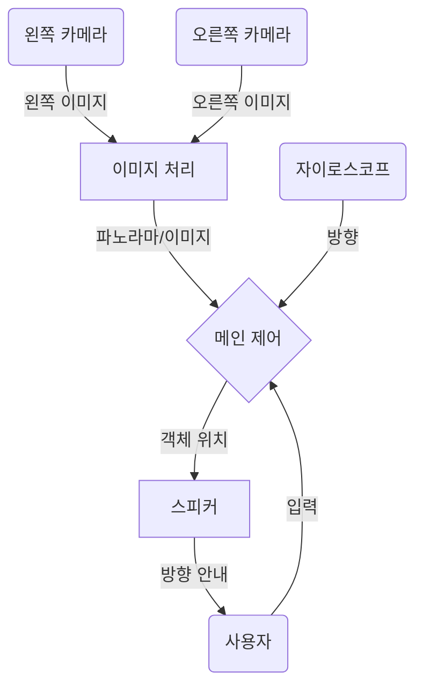

# Sight Research: Directing Visually Impaired Users with Smart Glasses

This repository details my research process on directing the gaze of visually impaired individuals using smart glasses. This is a critical area of focus because if a visually impaired user is searching for an object that is outside the smart glasses' camera's field of view, the system cannot process the command effectively. 한국어
### Method

I propose a method to guide a user's gaze when they command AI-powered smart glasses to locate an object. The smart glasses would capture a wide-angle photo and process it to search for the requested object. If the object is not found, the glasses would direct the user to rotate in a specific direction. This rotation allows the glasses to capture another photo from a new viewing angle. This iterative process continues until the object is located, at which point the glasses would direct the user to reach in the general direction of the object. While not the sole method for object localization, I believe this approach offers the most efficient solution given the current technological limitations of smart glasses.

**[ADD GIF SHOWING HOW IT WOULD WORK]**

To assess the viability of this method, we must understand several key concepts:

- Camera Configuration
- Image Stitching
- Gyroscope Use

We will now examine each of these components and discuss their contribution to the process of object finding through AI glasses.

## Camera Angle of View

### One Camera

The camera's specifications, particularly its Angle of View (AOV), determine the range of the smart glasses' visual field. AOV refers to the maximum extent a camera can capture through its lens. A wider AOV provides a broader viewing angle but introduces more radial distortion, causing straight lines to appear curved. Conversely, a narrower AOV reduces distortion but captures less information. Below, I have set up a simulation to illustrate the outputs of different AOVs. The wide camera is set at a 120-degree AOV, while the narrow camera is set at a 60-degree AOV. 

  

As demonstrated in the simulation above, the red ball appears in the wide-angle camera's view first, followed by the narrower camera. However, you can also observe that the wide-angle camera exaggerates depth, making the red ball appear farther away than its actual distance. Furthermore, wide-angle cameras are more susceptible to radial distortion; objects closer to the camera become increasingly stretched. The bottom simulation clearly illustrates this, showing that the square face is more distorted in the wide-angle camera's view compared to the narrow-angle camera's.

  

|      | Wide AOV Camera                        | Narrow AOV Camera                 |
| ---- | -------------------------------------- | --------------------------------- |
| Pros | - Can capture more information         | - Less likely to have distortion  |
| Cons | - Prone to radial and depth distortion | - Less information being captured |

The table above clearly demonstrates that both wide and narrow AOV cameras have distinct applications. For our purpose of quickly locating objects with an AI camera, a wide AOV camera would be more beneficial.

This choice is preferable because a wider AOV more closely approximates the natural field of human vision. This similarity in visual perception would allow the user to interact with the AI glasses more intuitively, as if the device were an extension of their own eyes.

---
### Two Cameras

Upon further inspection, I realized that if the smart glasses were to use two cameras, we could estimate the object's distance from the user through **stereo vision**. Knowing an object's depth is crucial for gaze processing; if an object is out of reach, the user needs to be aware that it's beyond their range.

Stereo vision operates by comparing two photos captured simultaneously by two cameras positioned at a fixed distance from each other. This technique leverages the similar triangle rule, where the line connecting two corresponding points in the separate images is parallel to the line between the two cameras.

  
|  |  |
| ---------------------------- | ---------------------------- |

By comparing the real-world distance between the cameras to the digital distance of similar points within the images, we can apply the similar triangle rule, as shown in the equation below:

$$
 \frac{T}{Z}=\frac{T+{x}_l-{x}_r}{Z-f} \to Z=\frac{f\cdot T}{{x}_l-{x}_r}
$$

Using this equation, I simulated and tested how different AOV glasses could determine depth. In the simulation below, I evaluated the ability of 60 AOV and 120 AOV cameras to ascertain the depth of a red ball. The measured depth is displayed in the bottom-left corner, and the views from the left and right cameras are shown. I calculated the percent error by comparing the measured values at the 0.5-meter and 1-meter marks. Note that each grid square represents 0.5 meters.

**60 AOV Stereo Camera**

  
  

**120 AOV Stereo Camera**

  
  

| 60 AOV      |                  |                    |
| ----------- | ---------------- | ------------------ |
| *Distance*  | *Measured Value* | *Percetange Error* |
| 0.5 m       | 0.528 m          | 5.6%               |
| 1.0 m       | 1.026 m          | 2.6%               |
|             |                  |                    |
| **120 AOV** |                  |                    |
| *Distance*  | *Measured Value* | *Percetange Error* |
| 0.5 m       | 0.911 m          | 82.2%              |
| 1.0 m       | 2.501 m          | 150.1%             |

As the table above illustrates, the percentage error in depth increases drastically from a 60 AOV to a 120 AOV, indicating that a wider angle of view makes accurate depth perception more challenging. However, there are limitations to this conclusion. The depth calculation requires focal length, yet the vision sensor in the simulation provides only AOV and camera resolution. This necessitated calibrating the FOV using known distances and then calculating the focal point. Since the focal length might not be precisely accurate, it introduces uncertainty into these results.

**One Wide, One Narrow?**
I considered testing a combination of one wide-angle and one narrow-angle camera, with the idea that the wide-angle camera could spot objects while the narrow-angle camera calculated depth. Although technically feasible with prior calibration, this approach would not be practical. It would be more efficient to utilize two wide-angle cameras and calibrate them beforehand for accurate depth estimation. This setup would offer a broader field of view while still providing precise depth information.
## Image Stitching

If we use two cameras to measure depth, we can also put their two images together to create a single panorama using a technique called image stitching. This approach would simulate human vision more accurately and give the AI a better understanding of an object's location relative to where the user is looking. A continuous panoramic photo offers a superior representation compared to two separate images.

OpenCV, an open-source computer vision software library, provides image stitching functionalities. The full stitching tutorial is avaliable in this [github](https://github.com/OpenStitching/stitching_tutorial/blob/master/docs/Stitching%20Tutorial.md), however here is a simplified overview of the process involves several steps:
Lets say we are given these four images and asked to create one photo. Let's say they are images one through four from left to right.

  
  

1. Resizing: Images are initially resized to a medium resolution. This makes processing these images easier.

2. Feature Detection: The system then identifies unique features or elements within these images that may also be present in other images.

  
  

3. Feature Matching: These features are matched across corresponding images to determine which images have a high confidence of overlap. These matches are based on confidence. For example, image 1 and 2 has high confidence that they are a match. However, image 4 would have low confidence with all other images, showing that image 4 is not part of this panorama.

  
  

4. Subset Creation and Warping: Subsets of relevant images are created, and these photos are then warped to ensure correct composition.

5. Cropping and Stitching: Finally, the images are cropped and seamlessly stitched together, prioritizing areas with minimal interference.

  
  

  
  

The common practice of security companies using two cameras to achieve a 180-degree field of view (AOV) demonstrates the viability of image stitching for creating seamless panoramic images. 
## Gyroscope and Speaker Use
**Gyroscope**
A gyroscope is essential for the AI glasses to determine the user's gaze direction. When the user turns their head to locate an object, a new image needs to be captured once they're facing a different angle than before. A gyroscope measures changes in rotational axis, enabling the system to take a photo at precisely the right moment.

  
  

This is a simulated example of how the glasses would direct the user to find an object, in this case, a red sphere. Since we know the combined AOV of the two cameras and their initial orientation, we can determine when the user changes direction. When the user moves outside the AOV of the initial picture, a new image is captured to continue searching for the object. This process repeats until the object is found. Once we have an image of the object, we can calculate its depth using stereo vision. Additionally, we can determine the object's offset from the center of the image by finding the average pixel position of the object and measuring its distance from the central axis.

  
  

**Speakers**
Building on the location data, we can guide users to an object using spatial audio cues delivered through stereo speakers. This involves employing the Head-Related Transfer Function (HRTF), which models how our ears perceive sound from specific points in space.

  
  

For instance, if an object is located to the user's right and slightly below chest level, we can use HRTF to generate a "ping" sound that appears to originate from that precise direction. This spatialized audio enables the user to intuitively reach towards the object.

HRTF works by calculating how an incoming sound wave, from its source, is filtered by the diffraction and reflection caused by the user's head before it reaches their ears. By creating digital filters that mimic these real-world acoustic effects, we can accurately recreate these spatial cues, providing an immersive and directional auditory experience.

## Putting it All Together

This understanding confirms the initial method's feasibility. By using two wide Angle of View (AOV) cameras, we can achieve a panoramic view with depth sensing, effectively simulating human vision. The user would then look around to find an object. When the glasses detect a new viewing direction via the gyroscope, a new photo is taken. Once the object is located, we can determine its position and guide the user with an audio ping indicating its estimated location. This system would allow users to find objects solely with AI glasses.
