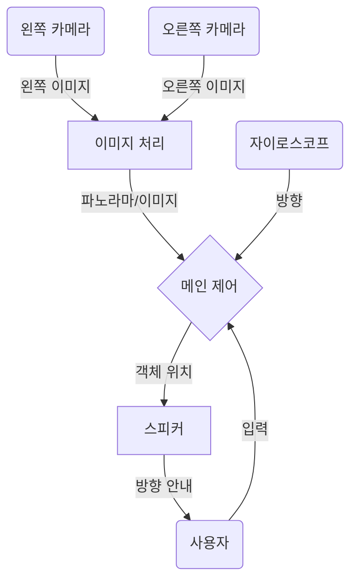

# 시선처: 스마트 안경으로 시각 장애인 사용자 안내하기

이 저장소는 스마트 안경을 사용하여 시각 장애인의 시선을 유도하는 저의 연구 과정을 상세히 설명합니다. 시각 장애인 사용자가 스마트 안경 카메라의 시야 범위 밖에 있는 물체를 찾으려 할 경우, 시스템이 명령을 효과적으로 처리할 수 없기 때문에 이 분야는 매우 중요합니다.
### 방법

저는 AI 기반 스마트 안경에 특정 물체를 찾아달라고 명령했을 때, 사용자의 시선을 안내하는 방법을 제안합니다. 스마트 안경은 광각 사진을 촬영하고 이를 처리하여 요청된 물체를 검색합니다. 만약 물체가 발견되지 않으면, 안경은 사용자에게 특정 방향으로 회전하도록 지시합니다. 이 회전을 통해 안경은 새로운 시야각에서 또 다른 사진을 촬영할 수 있습니다. 이 반복적인 과정은 물체가 발견될 때까지 계속되며, 물체가 발견되면 안경은 사용자에게 해당 물체의 대략적인 방향으로 손을 뻗도록 지시합니다. 물체 위치 파악을 위한 유일한 방법은 아니지만, 현재 스마트 안경의 기술적 한계를 고려할 때 이 접근 방식이 가장 효율적인 해결책이라고 생각합니다.

이 방법의 실현 가능성을 평가하기 위해 몇 가지 핵심 개념을 이해해야 합니다:

- 카메라 구성
- 이미지 스티칭
- 자이로스코프 사용

이제 각 구성 요소를 살펴보고 AI 안경을 통한 물체 찾기 과정에 어떻게 기여하는지 논의하겠습니다.

## 카메라 시야각

### 단일 카메라

카메라의 사양, 특히 **시야각(AOV)**은 스마트 안경의 시각적 범위(시야)를 결정합니다. AOV는 카메라가 렌즈를 통해 캡처할 수 있는 최대 범위를 나타냅니다. AOV가 넓을수록 더 넓은 시야각을 제공하지만, 방사형 왜곡이 더 많이 발생하여 직선이 곡선으로 보이게 됩니다. 반대로 AOV가 좁으면 왜곡은 줄어들지만 더 적은 정보를 캡처합니다. 아래에서는 다양한 AOV의 결과물을 보여주기 위한 시뮬레이션을 설정했습니다. 광각 카메라는 120도 AOV로 설정되었고, 협각 카메라는 60도 AOV로 설정되었습니다.

  

위 시뮬레이션에서 보듯이 빨간 공은 광각 카메라 뷰에 먼저 나타나고, 이어서 협각 카메라 뷰에 나타납니다. 하지만 광각 카메라가 깊이를 과장하여 빨간 공이 실제 거리보다 더 멀리 있는 것처럼 보이게 한다는 점도 확인할 수 있습니다. 게다가 광각 카메라는 방사형 왜곡에 더 취약하여 카메라에 가까운 물체는 점점 더 늘어나 보입니다. 아래 시뮬레이션은 이를 명확히 보여주는데, 정사각형 면이 협각 카메라 뷰에 비해 광각 카메라 뷰에서 더 많이 왜곡되어 있습니다.

  

|      | 광각 AOV 카메라                        | 협각 AOV 카메라                |
| ---- | -------------------------------------- | --------------------------------- |
| 장점 | - 더 많은 정보 캡처 가능         | - 왜곡 발생 가능성 낮음  |
| 단점 | - 방사형 및 깊이 왜곡에 취약 | - 캡처되는 정보량 적음 |

광각 AOV 카메라	협각 AOV 카메라
장점	- 더 많은 정보 캡처 가능	- 왜곡 발생 가능성 낮음
단점	- 방사형 및 깊이 왜곡에 취약	- 캡처되는 정보량 적음

The table above clearly demonstrates that both wide and narrow AOV cameras have distinct applications. For our purpose of quickly locating objects with an AI camera, a wide AOV camera would be more beneficial.

This choice is preferable because a wider AOV more closely approximates the natural field of human vision. This similarity in visual perception would allow the user to interact with the AI glasses more intuitively, as if the device were an extension of their own eyes.

---
### Two Cameras

Upon further inspection, I realized that if the smart glasses were to use two cameras, we could estimate the object's distance from the user through **stereo vision**. Knowing an object's depth is crucial for gaze processing; if an object is out of reach, the user needs to be aware that it's beyond their range.

Stereo vision operates by comparing two photos captured simultaneously by two cameras positioned at a fixed distance from each other. This technique leverages the similar triangle rule, where the line connecting two corresponding points in the separate images is parallel to the line between the two cameras.

  
|  |  |
| ---------------------------- | ---------------------------- |

By comparing the real-world distance between the cameras to the digital distance of similar points within the images, we can apply the similar triangle rule, as shown in the equation below:

$$
 \frac{T}{Z}=\frac{T+{x}_l-{x}_r}{Z-f} \to Z=\frac{f\cdot T}{{x}_l-{x}_r}
$$

Using this equation, I simulated and tested how different AOV glasses could determine depth. In the simulation below, I evaluated the ability of 60 AOV and 120 AOV cameras to ascertain the depth of a red ball. The measured depth is displayed in the bottom-left corner, and the views from the left and right cameras are shown. I calculated the percent error by comparing the measured values at the 0.5-meter and 1-meter marks. Note that each grid square represents 0.5 meters.

**60 AOV Stereo Camera**

  
  

**120 AOV Stereo Camera**

  
  

| 60 AOV      |                  |                    |
| ----------- | ---------------- | ------------------ |
| *Distance*  | *Measured Value* | *Percetange Error* |
| 0.5 m       | 0.528 m          | 5.6%               |
| 1.0 m       | 1.026 m          | 2.6%               |
|             |                  |                    |
| **120 AOV** |                  |                    |
| *Distance*  | *Measured Value* | *Percetange Error* |
| 0.5 m       | 0.911 m          | 82.2%              |
| 1.0 m       | 2.501 m          | 150.1%             |

As the table above illustrates, the percentage error in depth increases drastically from a 60 AOV to a 120 AOV, indicating that a wider angle of view makes accurate depth perception more challenging. However, there are limitations to this conclusion. The depth calculation requires focal length, yet the vision sensor in the simulation provides only AOV and camera resolution. This necessitated calibrating the FOV using known distances and then calculating the focal point. Since the focal length might not be precisely accurate, it introduces uncertainty into these results.

**One Wide, One Narrow?**
I considered testing a combination of one wide-angle and one narrow-angle camera, with the idea that the wide-angle camera could spot objects while the narrow-angle camera calculated depth. Although technically feasible with prior calibration, this approach would not be practical. It would be more efficient to utilize two wide-angle cameras and calibrate them beforehand for accurate depth estimation. This setup would offer a broader field of view while still providing precise depth information.
## Image Stitching

If we use two cameras to measure depth, we can also put their two images together to create a single panorama using a technique called image stitching. This approach would simulate human vision more accurately and give the AI a better understanding of an object's location relative to where the user is looking. A continuous panoramic photo offers a superior representation compared to two separate images.

OpenCV, an open-source computer vision software library, provides image stitching functionalities. The full stitching tutorial is avaliable in this [github](https://github.com/OpenStitching/stitching_tutorial/blob/master/docs/Stitching%20Tutorial.md), however here is a simplified overview of the process involves several steps:
Lets say we are given these four images and asked to create one photo. Let's say they are images one through four from left to right.

  
  

1. Resizing: Images are initially resized to a medium resolution. This makes processing these images easier.

2. Feature Detection: The system then identifies unique features or elements within these images that may also be present in other images.

  
  

3. Feature Matching: These features are matched across corresponding images to determine which images have a high confidence of overlap. These matches are based on confidence. For example, image 1 and 2 has high confidence that they are a match. However, image 4 would have low confidence with all other images, showing that image 4 is not part of this panorama.

  
  

4. Subset Creation and Warping: Subsets of relevant images are created, and these photos are then warped to ensure correct composition.

5. Cropping and Stitching: Finally, the images are cropped and seamlessly stitched together, prioritizing areas with minimal interference.

  
  

  
  

The common practice of security companies using two cameras to achieve a 180-degree field of view (AOV) demonstrates the viability of image stitching for creating seamless panoramic images. 
## Gyroscope and Speaker Use
**Gyroscope**

A gyroscope is essential for the AI glasses to determine the user's gaze direction. When the user turns their head to locate an object, a new image needs to be captured once they're facing a different angle than before. A gyroscope measures changes in rotational axis, enabling the system to take a photo at precisely the right moment.

  
  

This is a simulated example of how the glasses would direct the user to find an object, in this case, a red sphere. Since we know the combined AOV of the two cameras and their initial orientation, we can determine when the user changes direction. When the user moves outside the AOV of the initial picture, a new image is captured to continue searching for the object. This process repeats until the object is found. Once we have an image of the object, we can calculate its depth using stereo vision. Additionally, we can determine the object's offset from the center of the image by finding the average pixel position of the object and measuring its distance from the central axis.

  
  

--- 
**Speakers**

Building on the location data, we can guide users to an object using spatial audio cues delivered through stereo speakers. This involves employing the Head-Related Transfer Function (HRTF), which models how our ears perceive sound from specific points in space.

  
  

For instance, if an object is located to the user's right and slightly below chest level, we can use HRTF to generate a "ping" sound that appears to originate from that precise direction. This spatialized audio enables the user to intuitively reach towards the object.

HRTF works by calculating how an incoming sound wave, from its source, is filtered by the diffraction and reflection caused by the user's head before it reaches their ears. By creating digital filters that mimic these real-world acoustic effects, we can accurately recreate these spatial cues, providing an immersive and directional auditory experience.

## Putting it All Together

This understanding confirms the initial method's feasibility. By using two wide Angle of View (AOV) cameras, we can achieve a panoramic view with depth sensing, effectively simulating human vision. The user would then look around to find an object. When the glasses detect a new viewing direction via the gyroscope, a new photo is taken. Once the object is located, we can determine its position and guide the user with an audio ping indicating its estimated location. This system would allow users to find objects solely with AI glasses.
