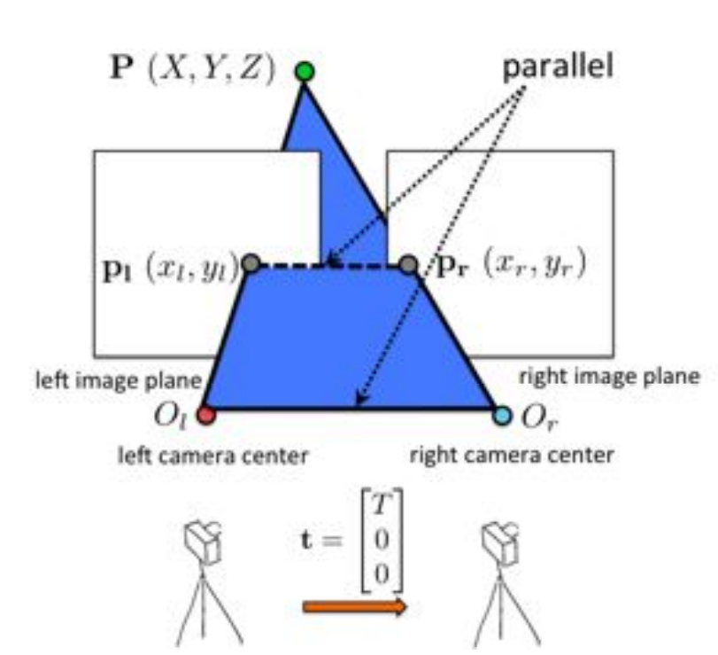
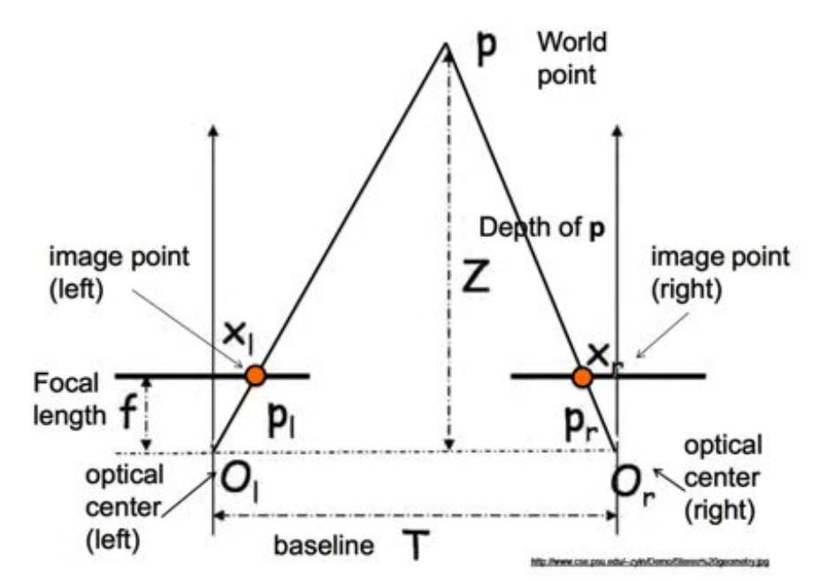
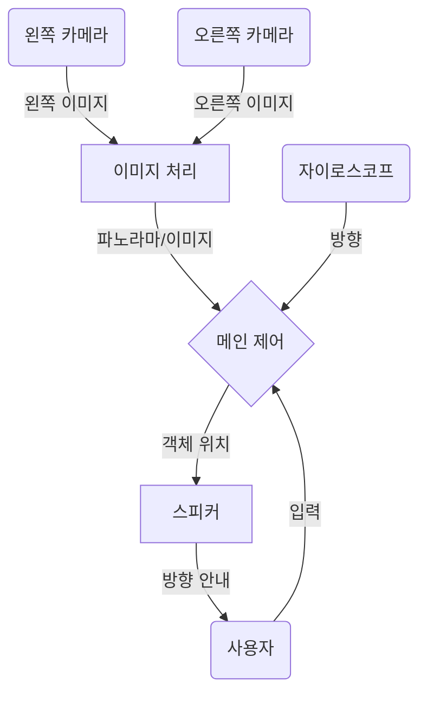

# 시선처: 스마트 안경으로 시각 장애인 사용자 안내하기

이 저장소는 스마트 안경을 사용하여 시각 장애인의 시선을 유도하는 저의 연구 과정을 상세히 설명합니다. 시각 장애인 사용자가 스마트 안경 카메라의 시야 범위 밖에 있는 물체를 찾으려 할 경우, 시스템이 명령을 효과적으로 처리할 수 없기 때문에 이 분야는 매우 중요합니다.
### 방법

저는 AI 기반 스마트 안경에 특정 물체를 찾아달라고 명령했을 때, 사용자의 시선을 안내하는 방법을 제안합니다. 스마트 안경은 광각 사진을 촬영하고 이를 처리하여 요청된 물체를 검색합니다. 만약 물체가 발견되지 않으면, 안경은 사용자에게 특정 방향으로 회전하도록 지시합니다. 이 회전을 통해 안경은 새로운 시야각에서 또 다른 사진을 촬영할 수 있습니다. 이 반복적인 과정은 물체가 발견될 때까지 계속되며, 물체가 발견되면 안경은 사용자에게 해당 물체의 대략적인 방향으로 손을 뻗도록 지시합니다. 물체 위치 파악을 위한 유일한 방법은 아니지만, 현재 스마트 안경의 기술적 한계를 고려할 때 이 접근 방식이 가장 효율적인 해결책이라고 생각합니다.

이 방법의 실현 가능성을 평가하기 위해 몇 가지 핵심 개념을 이해해야 합니다:

- 카메라 구성
- 이미지 스티칭
- 자이로스코프 사용

이제 각 구성 요소를 살펴보고 AI 안경을 통한 물체 찾기 과정에 어떻게 기여하는지 논의하겠습니다.

## 카메라 시야각

### 단일 카메라

카메라의 사양, 특히 **시야각(AOV)** 은 스마트 안경의 시각적 범위(시야)를 결정합니다. AOV는 카메라가 렌즈를 통해 캡처할 수 있는 최대 범위를 나타냅니다. AOV가 넓을수록 더 넓은 시야각을 제공하지만, 방사형 왜곡이 더 많이 발생하여 직선이 곡선으로 보이게 됩니다. 반대로 AOV가 좁으면 왜곡은 줄어들지만 더 적은 정보를 캡처합니다. 아래에서는 다양한 AOV의 결과물을 보여주기 위한 시뮬레이션을 설정했습니다. 광각 카메라는 120도 AOV로 설정되었고, 협각 카메라는 60도 AOV로 설정되었습니다.

  

위 시뮬레이션에서 보듯이 빨간 공은 광각 카메라 뷰에 먼저 나타나고, 이어서 협각 카메라 뷰에 나타납니다. 하지만 광각 카메라가 깊이를 과장하여 빨간 공이 실제 거리보다 더 멀리 있는 것처럼 보이게 한다는 점도 확인할 수 있습니다. 게다가 광각 카메라는 방사형 왜곡에 더 취약하여 카메라에 가까운 물체는 점점 더 늘어나 보입니다. 아래 시뮬레이션은 이를 명확히 보여주는데, 정사각형 면이 협각 카메라 뷰에 비해 광각 카메라 뷰에서 더 많이 왜곡되어 있습니다.

  

|      | 광각 AOV 카메라                        | 협각 AOV 카메라                |
| ---- | -------------------------------------- | --------------------------------- |
| 장점 | - 더 많은 정보 캡처 가능         | - 왜곡 발생 가능성 낮음  |
| 단점 | - 방사형 및 깊이 왜곡에 취약 | - 캡처되는 정보량 적음 |

위 표에서 분명히 알 수 있듯이, 광각 AOV 카메라와 협각 AOV 카메라 모두 뚜렷한 활용 분야를 가지고 있습니다. AI 카메라로 물체를 신속하게 찾는 우리의 목적에는 광각 AOV 카메라가 더 유용할 것입니다.

이러한 선택이 더 바람직한 이유는 더 넓은 AOV가 인간의 자연스러운 시야에 더 가깝기 때문입니다. 시각적 인지에서의 이러한 유사성은 사용자가 마치 스마트 안경이 자신의 눈의 확장인 것처럼 장치와 더 직관적으로 상호작용할 수 있도록 해줄 것입니다.

---
### Two Cameras

자세히 살펴보니, 스마트 안경에 두 개의 카메라를 사용하면 스테레오 비전을 통해 사용자로부터 물체까지의 거리를 추정할 수 있다는 것을 깨달았습니다. 물체의 깊이를 아는 것은 시선 처리(gaze processing)에 매우 중요합니다. 만약 물체가 손이 닿지 않는 거리에 있다면, 사용자는 그것이 자신의 도달 범위를 넘어섰다는 것을 인지해야 하기 때문입니다.

스테레오 비전은 고정된 거리에 떨어져 위치한 두 대의 카메라가 동시에 촬영한 두 장의 사진을 비교하여 작동합니다. 이 기술은 두 개의 개별 이미지에서 상응하는 두 점을 연결하는 선이 두 카메라 사이의 선과 평행하다는 닮은꼴 삼각형 규칙을 활용합니다.

  
|  |  |
| ---------------------------- | ---------------------------- |

실제 카메라 간의 거리와 이미지 내 유사 지점 간의 디지털 거리를 비교함으로써, 아래 방정식에서 볼 수 있듯이 닮은꼴 삼각형 규칙을 적용할 수 있습니다:

$$
 \frac{T}{Z}=\frac{T+{x}_l-{x}_r}{Z-f} \to Z=\frac{f\cdot T}{{x}_l-{x}_r}
$$

이 공식을 활용하여 다양한 AOV(시야각) 안경이 어떻게 깊이를 측정하는지 시뮬레이션하고 테스트했습니다. 아래 시뮬레이션에서는 60도 AOV 및 120도 AOV 카메라가 빨간색 공의 깊이를 측정하는 능력을 평가했습니다. 측정된 깊이는 좌측 하단에 표시되며, 좌우 카메라의 시야가 함께 나타납니다. 저는 0.5미터 및 1미터 지점에서 측정된 값들을 비교하여 오차율을 계산했습니다. 각 격자 사각형이 0.5미터를 나타냅니다. **ADD MORE**

**60도 AOV 스테레오 카메라**

  
  

**120도 AOV 스테레오 카메라**

  
  

| 60 AOV         |                      |                        |     | 120 AOV              |                        |
| -------------- | -------------------- | ---------------------- | --- | -------------------- | ---------------------- |
| *거리 (m)* | *측정값 (m)* | *오차율 (%)* |     | *측정값 (m)* | *오차율 (%)* |
| 0.2            | 0.1916               | 4.20                   |     | 0.3453               | 72.7                   |
| 0.3            | 0.2956               | 1.47                   |     | 0.5008               | 66.9                   |
| 0.4            | 0.3875               | 0.625                  |     | 0.6677               | 66.9                   |
| 0.5            | 0.5283               | 5.66                   |     | 0.9112               | 82.2                   |
| 0.6            | 0.5813               | 3.12                   |     | 1.1129               | 85.5                   |
| 0.7            | 0.9178               | 31.1                   |     | 1.2523               | 78.9                   |
| 0.8            | 0.7926               | 0.925                  |     | 1.4309               | 78.7                   |
| 0.9            | 0.8719               | 3.12                   |     | 1.6694               | 85.5                   |
| 1.0            | 1.026                | 2.50                   |     | 2.501                | 150                    |

위 표에서 볼 수 있듯이, 깊이 측정의 오차율은 60도 AOV에서 120도 AOV로 갈수록 급격히 증가하며, 이는 광각 시야가 정확한 깊이 인식을 더 어렵게 만든다는 것을 시사합니다. 하지만 이 결론에는 한계가 있습니다. 깊이 계산에는 초점 거리가 필요하지만, 시뮬레이션의 비전 센서는 AOV와 카메라 해상도만 제공합니다. 따라서 알려진 거리를 사용하여 FOV(시야각)를 보정하고 초점 거리를 계산해야 했습니다. 초점 거리가 정확하지 않을 수 있으므로, 이러한 결과에는 불확실성이 존재합니다.

**광각 하나, 협각 하나?**
저는 광각 카메라가 물체를 포착하고 협각 카메라가 깊이를 계산하는 방식으로, 광각 카메라 하나와 협각 카메라 하나를 조합하여 테스트하는 것을 고려했습니다. 사전 보정을 통해 기술적으로는 실현 가능하지만, 이 접근 방식은 실용적이지 않을 것입니다. 오히려 두 개의 광각 카메라를 활용하고 사전에 정확한 깊이 추정을 위해 보정하는 것이 더 효율적입니다. 

120도 AOV 카메라 설정의 오차율을 보면, (150%를 특이치로 간주할 경우) 66.9%에서 85.5% 사이의 비교적 일관된 범위를 보입니다. 이러한 일관된 오차는 우리가 깊이 계산을 사전에 보정하거나 이미지의 왜곡을 제거할 수 있음을 나타냅니다. 이 설정은 더 넓은 시야를 제공하면서도 정확한 깊이 정보를 얻을 수 있도록 해줄 것입니다.

## 이미지 스티칭

두 개의 카메라를 사용하여 깊이를 측정한다면, 이미지 스티칭이라는 기술을 통해 두 이미지를 하나로 합쳐 단일 파노라마를 만들 수도 있습니다. 이 접근 방식은 인간의 시야를 더 정확하게 모방하고 AI가 사용자의 시선과 관련하여 물체의 위치를 더 잘 이해하도록 돕습니다. 연속적인 파노라마 사진은 두 개의 개별 이미지보다 훨씬 우수한 표현을 제공합니다.

오픈 소스 컴퓨터 비전 소프트웨어 라이브러리인 OpenCV는 이미지 스티칭 기능을 제공합니다. 전체 스티칭 튜토리얼은 이 [github](https://github.com/OpenStitching/stitching_tutorial/blob/master/docs/Stitching%20Tutorial.md) 에서 확인할 수 있습니다. 하지만 다음은 이 과정의 간략한 개요입니다. 여러 단계를 포함하고 있습니다:

우리가 이 네 장의 이미지를 가지고 하나의 사진을 만들라고 요청받았다고 가정해 봅시다. 이 이미지들은 왼쪽에서 오른쪽으로 1번부터 4번까지라고 하겠습니다.

  
  

1. 크기 조정 (Resizing): 이미지는 초기 단계에서 중간 해상도로 크기가 조정됩니다. 이는 이미지 처리 과정을 더 쉽게 만듭니다.

2. 특징점 탐지 (Feature Detection): 시스템은 이미지 내에서 다른 이미지에도 존재할 수 있는 고유한 특징점이나 요소를 식별합니다.

  
  

3. 특징점 매칭 (Feature Matching): 이 특징점들을 해당하는 이미지들 간에 매칭하여 어떤 이미지들이 높은 신뢰도로 겹치는지 판단합니다. 이러한 매칭은 신뢰도에 기반합니다. 예를 들어, 이미지 1과 2는 서로 매칭될 가능성이 높다는 높은 신뢰도를 가집니다. 그러나 이미지 4는 다른 모든 이미지들과 낮은 신뢰도를 보이며, 이는 이미지 4가 이 파노라마의 일부가 아님을 나타냅니다.

  
  

4. 하위 집합 생성 및 이미지 변형 (Subset Creation and Warping): 관련 있는 이미지들로 하위 집합이 생성되고, 이 사진들은 정확한 구성을 위해 변형됩니다.

5. 자르기 및 스티칭 (Cropping and Stitching): 마지막으로, 이미지들은 최소한의 간섭이 발생하는 영역을 우선으로 하여 잘라지고 이음새 없이 하나로 합쳐집니다.

  
  

  
  

180도 시야각(AOV)을 구현하기 위해 두 대의 카메라를 사용하는 보안 회사들의 일반적인 관행은 이음매 없는 파노라마 이미지를 생성하는 데 있어 이미지 스티칭의 실현 가능성을 입증합니다. 
## 자이로스코프 및 스피커 사용
**자이로스코프**

자이로스코프는 AI 안경이 사용자의 시선 방향을 판단하는 데 필수적입니다. 사용자가 물체를 찾기 위해 고개를 돌릴 때, 이전과는 다른 각도를 향하게 되면 새로운 이미지를 촬영해야 합니다. 자이로스코프는 회전축의 변화를 측정하여 시스템이 정확한 순간에 사진을 찍을 수 있도록 합니다.

  
  

이것은 안경이 사용자에게 물체(이 경우 빨간 구체)를 찾는 방법을 안내하는 시뮬레이션 예시입니다. 위쪽에서는 스티칭된 이미지를 볼 수 있으며, 아래에는 왼쪽 및 오른쪽 카메라 뷰가 있습니다. 두 카메라의 시야각(AOV)과 초기 방향을 알고 있기 때문에 사용자가 방향을 바꿀 때를 파악할 수 있습니다. 사용자가 초기 사진의 AOV 밖으로 움직이면, 물체 탐색을 계속하기 위해 새로운 이미지가 촬영됩니다. 이 과정은 물체가 발견될 때까지 반복됩니다. 물체 이미지를 확보하면 스테레오 비전을 사용하여 물체의 깊이를 계산할 수 있습니다. 또한, 물체의 평균 픽셀 위치를 찾은 다음 중심 축에서 얼마나 떨어져 있는지 측정하여 이미지 중앙으로부터 물체의 **오프셋(편차)**을 확인할 수 있습니다.

  
  

--- 
**스피커**

위치 데이터를 활용하여, 스테레오 스피커를 통해 제공되는 공간 음향(spatial audio) 신호로 사용자에게 물체까지의 길을 안내할 수 있습니다. 이는 우리의 귀가 공간 내 특정 지점에서 오는 소리를 어떻게 인지하는지 모델링하는 **머리전달함수(HRTF: Head-Related Transfer Function)** 를 사용하는 것을 포함합니다.

  
  

예를 들어, 물체가 사용자의 오른쪽에 있고 가슴보다 약간 아래에 있다면, HRTF를 사용하여 해당 방향에서 들려오는 것처럼 느껴지는 "핑" 소리를 생성할 수 있습니다. 이 공간화된 오디오는 사용자가 직관적으로 물체 쪽으로 손을 뻗을 수 있도록 합니다.

HRTF는 음원으로부터 들어오는 음파가 귀에 도달하기 전에 사용자의 머리에 의한 회절과 반사로 인해 어떻게 필터링되는지 계산하여 작동합니다. 이러한 실제 음향 효과를 모방하는 디지털 필터를 생성함으로써, 우리는 이러한 중요한 공간 신호를 정확하게 재현하여 몰입감 있고 방향성 있는 청각 경험을 제공할 수 있습니다.

## Putting it All Together

이러한 이해는 처음에 제시된 방법의 실현 가능성을 확인시켜 줍니다. 두 개의 넓은 시야각(AOV: Angle of View) 카메라를 사용하여 깊이 감지 기능이 있는 파노라마 뷰를 구현함으로써, 인간의 시각을 효과적으로 모방할 수 있습니다. 사용자가 물체를 찾기 위해 주위를 둘러볼 때, 안경은 자이로스코프를 통해 새로운 시선 방향을 감지하면 새로운 사진을 촬영합니다. 물체가 일단 발견되면, 우리는 그 위치를 파악하고 오디오 핑을 통해 물체의 예상 위치를 사용자에게 알려 안내할 수 있습니다. 이 시스템은 사용자가 AI 안경만으로도 물체를 찾을 수 있도록 해줍니다.
